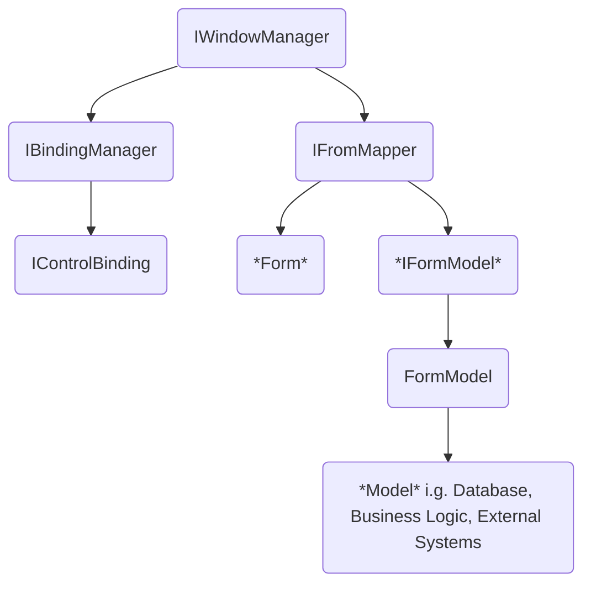

# Create a MFFM framework for WinForms like MVVM for MPF

## Context and Problem Statement

It is state of the art for a WPF application to use the MVVM pattern. A lot of frameworks for WPF are out there to support this, almost no frameworks apply this pattern to Windows Forms.

As WinForms uses forms instead of views, the approach is called MFFM aka. model-form-formmodel.

Binding is supported by default in Windows Forms, a MFFM approach shall be evaluated using as many internal functionality as possible.

## Considered Options

* Concepts similar to Caliburn.Micro for WPF
* Failure is an option

## Decision Outcome

Choosen option is: "Concepts similar to Caliburn.Micro" with the following design principles:

* Use data binding for a view model (form model) to view (form) binding
* No code-behind or form model knowledge in form
* No form knowledge in form model
* Minimal core with extensibility
* Use and describe design pattern and clean code principles

### Consequences

## Diagram

The following diagram shows the different interfaces and dependency levels.

